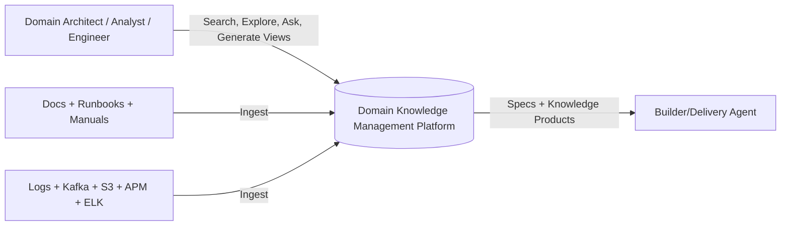
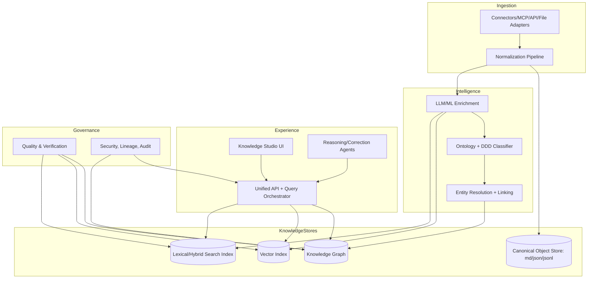
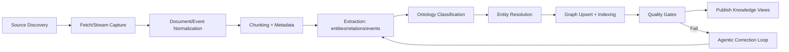

# Domain Knowledge Management (Enterprise)

## 1) Vision
Build a **domain-agnostic knowledge management platform** that ingests enterprise source material (docs + operational telemetry), continuously structures it into a living knowledge repository, and exposes it for:
- semantic search and retrieval,
- ontology-driven classification and graph navigation,
- domain and enterprise-realization views,
- agentic analysis and correction,
- optional hand-off to builder agents for service/spec generation.

Initial focus domain: **Payments**. Platform design remains reusable for any business domain.

---

## 2) Source Categories and Canonicalization

### Input sources
- Vendor product documentation (multi-version)
- Project documentation (customizations + integrations)
- Service/runtime logs
- Event streams (Kafka, S3)
- APM traces
- ELK metrics
- Change/runbooks
- Operational procedures, manuals, guides

### Canonical formats
- **Markdown (`.md`)** for narrative/unstructured text and extracted summaries
- **JSON/JSONL (`.json`, `.jsonl`)** for structured records, events, metrics, extracted entities/relations

---

## 3) Strategic DDD-Guided Knowledge Model
The model is anchored in Strategic Domain-Driven Design:
- **Domain / Subdomain**: Core, Supporting, Generic
- **Bounded Context**: business + technical context boundaries
- **Context Map**: relationships (Partnership, Conformist, ACL, Published Language, etc.)
- **Domain Concepts**: Aggregates, Entities, Value Objects, Domain Events, Policies, Commands, Queries
- **Capabilities**: business capabilities linked to systems/services
- **Enterprise Realization Layer**: maps “pure domain” concepts to concrete implementation (apps, teams, services, data stores, interfaces)

### Ontology high-level classes
- `BusinessCapability`
- `BoundedContext`
- `DomainConcept`
- `Service`
- `System`
- `DataProduct`
- `Event`
- `Metric`
- `Runbook`
- `Integration`
- `EvidenceArtifact`

### Core relation examples
- `implements(Service -> DomainConcept)`
- `belongsTo(Service -> BoundedContext)`
- `supports(System -> BusinessCapability)`
- `emits(System/Service -> Event)`
- `observedBy(Event/Service -> Metric/Trace/Log)`
- `dependsOn(Service -> Service/System)`
- `governedBy(Service/System -> Runbook/Policy)`
- `evidencedBy(Any -> EvidenceArtifact)`

---

## 4) Monorepo Module Plan (well bounded)

```text
/domain-knowledge-management
  /apps
    /api-gateway                 # unified API for search/graph/views/agents
    /knowledge-studio            # analyst and architect UX
  /modules
    /source-connectors           # MCP/tools/APIs/files ingestion adapters
    /normalization               # parsing, canonical markdown/json/jsonl conversion
    /enrichment                  # NLP/LLM extraction, classification, chunking, embeddings
    /ontology                    # DDD ontology, taxonomy, schema evolution
    /entity-resolution           # dedupe, record linkage, confidence scoring
    /knowledge-graph             # graph persistence + relation management
    /indexing-retrieval          # vector + lexical + hybrid retrieval
    /reasoning-agents            # query planning, synthesis, correction agents
    /quality-verification        # data quality checks, evals, drift/lineage checks
    /spec-generation             # optional system/spec outputs for builder handoff
  /platform
    /event-bus                   # pipeline messaging and orchestration events
    /workflow-orchestration      # DAGs, retries, schedules, backfills
    /security-governance         # RBAC/ABAC, policy, audit
    /observability               # metrics/traces/logging for the platform itself
  /schemas
    /canonical                   # canonical JSON schemas
    /ontology                    # ontology schema and relation definitions
  /prompts
    /extractors
    /validators
    /synthesis
  /evals
    /golden-datasets
    /benchmarks
  /docs
    /architecture
    /adr
```

---

## 5) Architecture (C4-style)

### C4 Level 1 - Context


### C4 Level 2 - Containers


### C4 Level 3 - Ingestion/Knowledge Pipeline


---

## 6) Domain-Agnostic + Domain-Specific Layering

1. **Global Ontology Layer**: reusable classes/relations across all domains.
2. **Domain Pack Layer** (e.g., Payments): specialized vocabulary and rules.
3. **Enterprise Realization Layer**: mappings from abstract domain concepts to enterprise systems/services/data.
4. **Evidence Layer**: traceable links to source snippets, logs, traces, and metrics for every asserted fact.

For Payments, example mapping:
- `DomainConcept: Authorization` -> `Service: payment-auth-svc` -> `System: card-processing-platform`
- `DomainEvent: PaymentCaptured` -> Kafka topic, logs, traces, runbooks, SLO metrics

---

## 7) Pipeline and Agentic Operating Model

### Pipeline types
- **Batch**: historical docs, version migrations, backfills
- **Streaming/Near-real-time**: Kafka/APM/ELK/log feeds
- **On-demand**: ad-hoc domain exploration or incident investigations

### Agent roles
- **Extractor agents**: pull entities/relations from canonical artifacts
- **Ontology alignment agents**: map extracted facts to DDD model
- **Contradiction agents**: detect conflicting facts and stale links
- **Correction agents**: propose graph/index fixes with confidence and provenance
- **Synthesis agents**: generate bounded context views, dependency maps, and build specs

### Human-in-the-loop
- confidence thresholds for auto-merge vs manual approval
- reviewer queue for low-confidence/high-impact updates
- explainability bundle for each mutation (prompt, source evidence, confidence, diff)

---

## 8) Quality, Verification, and Trust

### Verification gates
1. **Schema validation** (canonical JSON/JSONL + ontology constraints)
2. **Evidence completeness** (every fact linked to provenance)
3. **Consistency checks** (no invalid relationship cardinality/cycles where prohibited)
4. **Temporal freshness checks** (staleness/TTL policies)
5. **Cross-source corroboration score**
6. **LLM extraction evals** against golden datasets
7. **Retrieval quality evals** (precision@k, recall@k, groundedness)

### Suggested KPIs
- Ontology coverage (% assets classified)
- Link accuracy / entity-resolution precision
- Evidence completeness ratio
- Stale fact ratio
- Query answer groundedness and citation quality
- Mean correction latency (detection -> fixed)

---

## 9) Evolution and Change Management

- Ontology semantic versioning (`major.minor.patch`)
- Backward-compatible relation deprecations with migration windows
- Re-index/re-link pipelines for ontology upgrades
- Continuous drift detection (source schema drift + concept drift)
- ADR-based architectural decision log for major changes

---

## 10) Modern Tech Stack Options (decision candidates)

### Core platform
- **Languages**: TypeScript + Python
- **Workflow orchestration**: Temporal / Dagster / Airflow (Temporal preferred for long-lived reliable workflows)
- **Messaging/stream**: Kafka + schema registry
- **Storage**:
  - object store: S3-compatible
  - graph DB: Neo4j / Amazon Neptune
  - vector DB: pgvector / OpenSearch / Weaviate
  - search: OpenSearch/Elasticsearch

### AI/ML/GenAI
- LLM gateway with model routing (OpenAI/Anthropic/local)
- Embeddings model registry and periodic re-embedding policy
- RAG orchestration with grounded citation enforcement
- Evaluation framework (offline + continuous online checks)
- Guardrails (PII redaction, policy checks, prompt/version tracking)

### APIs and protocols
- MCP server support for source/tool integration
- GraphQL + REST for consumer access
- Event-driven APIs for downstream subscribers

### Security and governance
- OIDC/SAML SSO
- RBAC/ABAC (attribute-level control for sensitive domains)
- full lineage + immutable audit log
- encryption at rest/in transit and key rotation

---

## 11) Decision Log (initial)

| ID | Decision | Status | Rationale |
|---|---|---|---|
| D1 | Canonical intermediary format = Markdown + JSON/JSONL | Accepted | Maximizes interoperability and auditability |
| D2 | Strategic DDD as ontology backbone | Accepted | Aligns business and technical knowledge boundaries |
| D3 | Hybrid retrieval (graph + vector + lexical) | Accepted | Best balance for enterprise heterogeneous data |
| D4 | Agentic correction with human-in-loop thresholds | Accepted | Enables scale with controlled trust |
| D5 | Domain packs over global ontology | Accepted | Domain-agnostic core with domain-specific acceleration |
| D6 | Monorepo with bounded modules | Accepted | Separation of concerns with coordinated evolution |

---

## 12) Implementation Roadmap (no code yet)

### Phase 0 - Foundations
- define ontology v0 for cross-domain baseline
- establish canonical schema contracts
- stand up ingestion skeleton and lineage model

### Phase 1 - Payments pilot
- onboard high-value payment docs + selected operational streams
- model payment bounded contexts and context map
- launch search + graph exploration MVP

### Phase 2 - Agentic quality
- enable contradiction/correction agents
- add eval harness + golden datasets
- enforce confidence-based auto-merge policies

### Phase 3 - Spec handoff
- generate domain realization views as structured system specs
- integrate with downstream builder workflow (human-approved)

---

## 13) Definition of Done for Planning Stage
- Architecture agreed (context/container/pipeline views)
- DDD ontology baseline defined
- Module boundaries and ownership model agreed
- Quality and verification gates defined
- Initial stack shortlist and ADR backlog created
